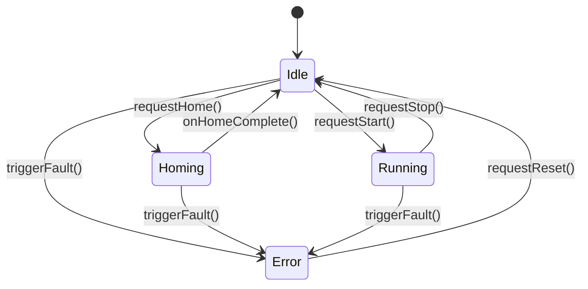

# Qt Equipment Simulator

A C++ desktop equipment simulator and learning project modeling automated semiconductor manufacturing equipment. Built using C++17, Qt6 Widgets, and modern POSIX/C++ concurrency primitives, the application models automated machine control software: live simulated multi-sensor telemetry, strict state machine lifecycle transitions (`Idle`, `Homing`, `Running`, `Error`), asynchronous background execution with a non-blocking GUI event loop, a hand-built mutex-guarded producer-consumer file logger with continuous rotation, and a SEMI E37 (HSMS) / SEMI E5 (SECS-II) communication engine over TCP/IP.

---

## 1. Build Instructions

### Prerequisites (Linux Mint / Ubuntu 24.04 LTS)
```bash
sudo apt update
sudo apt install build-essential cmake git
sudo apt install qt6-base-dev qt6-base-dev-tools qtcreator
sudo apt install doxygen graphviz
```

### Compiling with CMake
```bash
# Configure build directory
cmake -B build -DCMAKE_BUILD_TYPE=Release

# Build all targets (application and unit tests)
cmake --build build -j$(nproc)
```

---

## 2. Run Instructions

### Launching the Application
```bash
./build/equipment_sim
```

### Controlling Diagnostic Logging Rules
Qt's categorized logging enables granular runtime verbosity tuning without recompilation:
```bash
# Enable verbose debug logs for equipment core and worker ticks:
QT_LOGGING_RULES="equipment.core.debug=true" ./build/equipment_sim

# Enable threading diagnostics:
QT_LOGGING_RULES="equipment.threading.debug=true;equipment.gui.debug=true" ./build/equipment_sim

# Silence raw debug sensor ticks while retaining state transitions and warnings:
QT_LOGGING_RULES="equipment.core.debug=false" ./build/equipment_sim
```

---

## 3. Test Instructions

All subsystems are validated with targeted regression test suites using `ctest` and `QtTest`:
```bash
cd build
ctest --output-on-failure
```

### Individual Test Suites
| Test Executable | Target Layer | Scope |
|---|---|---|
| `test_equipmentstate` | Physics Engine | Position and temperature physical limits, deterministic jitter, state bounds |
| `test_worker_threading` | Concurrency | `moveToThread()`, `QSignalSpy` telemetry verification, 500x rapid start/stop stress test |
| `test_logger_thread` | Producer-Consumer | Multi-producer race verification, continuous 5MB rotation, **ThreadSanitizer-clean** (links no Qt) |
| `test_statemachine` | FSM Lifecycle | Enforces `Idle` -> `Homing` -> `Running` -> `Idle`, faults from any state, rejects invalid jumps |
| `test_gui_log` | UI Dispatch | Thread-safe queued log dispatch to `QListWidget` across thread boundaries |
| `test_secsgem` | Protocol Engine | SEMI E37 HSMS handshake (`NOT CONNECTED` -> `CONNECTED` -> `SELECTED`) and S1F1/S1F2 exchange |

---

## 4. Documentation Generation

The codebase is thoroughly documented using standard Doxygen tags with Graphviz dot inheritance diagrams:
```bash
cd docs
doxygen Doxyfile
```
Open [`docs/html/index.html`](docs/html/index.html) in any web browser to view class hierarchies, call graphs, and API references.

---

## 5. Architecture & Design Patterns

The architecture reflects mission-critical automated equipment software design principles:

### A. State Pattern (`StateMachine`)
Enforces strict semiconductor tool lifecycle constraints. The machine cannot initiate processing without homing, cannot jump from `Error` directly to `Running` without an explicit `Reset`, and can transition to `Error` immediately from **any** state upon an emergency fault.



### B. Observer Pattern (Qt Signals and Slots)
Cross-thread decoupled telemetry transmission:
- `EquipmentWorker` runs in a dedicated `QThread` driven by an autonomous 200ms `QTimer`.
- Telemetry data (`position`, `temperature`, `status`) is emitted via `dataUpdated(...)` and received by `MainWindow` through `Qt::QueuedConnection`, ensuring the GUI main thread never blocks or drops frames during high-frequency hardware updates.

### C. Producer-Consumer Pattern (`LoggerThread`)
A high-throughput, low-latency disk logging subsystem:
- Utilizes `std::queue<std::string>`, `std::mutex`, and `std::condition_variable`.
- **Zero-Block Critical Section**: The mutex protects *only* the queue insertion/removal. Disk I/O occurs strictly outside the lock, preventing slow physical drive flushes from stalling the simulation loop.
- **Continuous Size-Based Log Rotation**: Checks file size after each disk write. When the file reaches ~5 MB, it closes, renames the active log to `logs/equipment.log.1` (overwriting the previous backup), and opens a fresh log file.

### D. SEMI E37 (HSMS) & SEMI E5 (SECS-II) Integration
Implements standard factory automation communications over TCP/IP:
- **HSMS State Machine**: Manages states `NOT CONNECTED` -> `CONNECTED` -> `SELECTED`.
- **Select.req / Select.rsp**: Protocol handshake required before data transactions.
- **S1F1 / S1F2 Exchange**: Responds to host "Are You There" queries with equipment model (`EQUIP_SIM_2000`) and software revision (`1.0.0`).
- **Complete Audit Trail**: Every inbound and outbound message is logged via the `equipment.secsgem` category.

---

## 6. Known Engineering Trade-offs

### 1. Raw `std::mutex` vs. Idiomatic Qt Queued Signals
- **The Trade-off**: In pure Qt applications, passing log entries between threads via signals/slots is idiomatic. In this project, a raw `std::mutex` + `std::condition_variable` queue was deliberately chosen in `LoggerThread` to demonstrate direct control over POSIX/C++ synchronization primitives.
- **Why It Is Safe**: The lock is acquired only to push or pop from `m_queue`. Disk I/O and log formatting happen completely outside the lock, ensuring that worker threads never encounter priority inversion or latency spikes.

### 2. ThreadSanitizer (TSAN) Strategy
- **The Challenge**: Compiling entire Qt applications with `-fsanitize=thread` against standard distribution-installed Qt libraries generates extensive false positives due to Qt's internal atomic reference counting and lock-free event loop optimizations.
- **The Solution**: `LoggerThread`'s synchronization logic is completely decoupled from Qt (uses only standard library headers). Its test suite (`test_logger_thread`) links zero Qt libraries and compiles cleanly with `-fsanitize=thread`, confirming it is TSAN-clean under the test suite.

---

## 7. Project Layout
```
qt_equipment_simulator/
├── CMakeLists.txt                 # Root CMake build configuration
├── .gitignore                     # Git ignore rules for build, logs, venv
├── README.md                      # Complete architectural and operational manual
├── src/
│   ├── main.cpp                   # Application bootstrap and logging initialization
│   ├── Logging.h / .cpp           # Categorized logging, custom handler, GUI dispatcher
│   ├── EquipmentState.h / .cpp    # Pure simulation model and physics
│   ├── EquipmentWorker.h / .cpp   # Autonomous QObject worker with moveToThread
│   ├── LoggerThread.h / .cpp      # Hand-built mutex/condvar producer-consumer logger
│   ├── StateMachine.h / .cpp      # Finite state machine transition engine
│   ├── GaugeWidget.h / .cpp       # Custom QPainter analog dial gauge
│   ├── SecsProtocol.h             # HSMS SEMI E37 header and message framing
│   ├── SecsServer.h / .cpp        # Equipment HSMS server endpoint
│   ├── SecsClient.h / .cpp        # Host HSMS client endpoint
│   └── MainWindow.h / .cpp / .ui  # Main operator graphical interface
├── tests/
│   ├── CMakeLists.txt             # Test build configuration
│   ├── test_equipmentstate.cpp    # Physics model unit test
│   ├── test_worker_threading.cpp  # Concurrency and stress test
│   ├── test_logger_thread.cpp     # Pure C++ TSAN producer-consumer test
│   ├── test_statemachine.cpp      # FSM transition validity test
│   ├── test_gui_log.cpp           # Queued GUI log delivery test
│   └── test_secsgem.cpp           # HSMS & SECS-II integration test
├── docs/
│   └── Doxyfile                   # Doxygen API documentation configuration
└── logs/                          # Runtime log outputs (gitignored)
```
